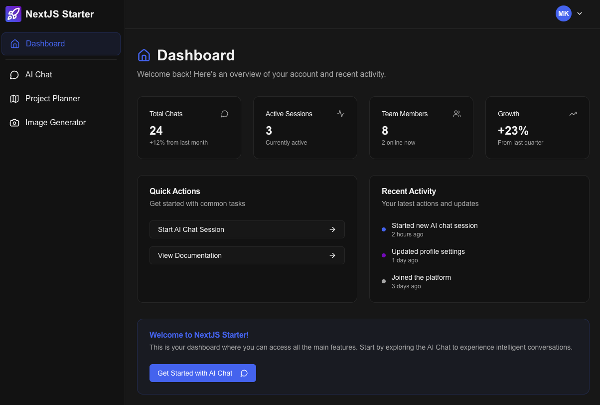

# Next.js SaaS Starter

This is a starter template for building a SaaS application using **Next.js** with support for Clerk authentication, Supabase database, Stripe payments, OpenAI integration, and a comprehensive dashboard for users.



## Features

- Marketing landing page (`/`) with hero section and feature highlights
- Pricing page with Stripe integration
- Dashboard pages with AI chat and coaching features
- User authentication and management with Clerk
- Subscription management and billing
- Account settings and user profiles
- Responsive design with dark/light mode support
- Webhook handling for real-time updates

## Tech Stack

- **Framework**: [Next.js](https://nextjs.org/)
- **Database**: [Supabase](https://supabase.com/)
- **Authentication**: [Clerk](https://clerk.com/)
- **Payments**: [Stripe](https://stripe.com/)
- **AI**: [OpenAI](https://openai.com/)
- **UI Library**: [shadcn/ui](https://ui.shadcn.com/)
- **Styling**: [Tailwind CSS](https://tailwindcss.com/)
- **Language**: [TypeScript](https://www.typescriptlang.org/)

## Prerequisites

Before you begin, ensure you have the following installed and set up:

### Required Software
- **Node.js** (v18 or higher): Download from [nodejs.org](https://nodejs.org/)
- **Git**: Download from [git-scm.com](https://git-scm.com/)
- **Ngrok**: For local webhook testing
  - **macOS**: `brew install ngrok/ngrok/ngrok` or download from [ngrok.com](https://ngrok.com/download)
  - **Windows**: Download from [ngrok.com](https://ngrok.com/download) and add to PATH
  - **Linux**: `sudo snap install ngrok` or download from [ngrok.com](https://ngrok.com/download)
  - After installation, sign up for a free account at [ngrok.com](https://ngrok.com/) and run `ngrok config add-authtoken <your-authtoken>`
- **Code Editor**: We recommend [VS Code](https://code.visualstudio.com/) with the following extensions:
  - TypeScript and JavaScript Language Features
  - Tailwind CSS IntelliSense
  - ES7+ React/Redux/React-Native snippets

### Required Accounts
- **Clerk**: Sign up at [clerk.com](https://clerk.com/) (for authentication)
- **Supabase**: Sign up at [supabase.com](https://supabase.com/) (for database)
- **OpenAI**: Sign up at [platform.openai.com](https://platform.openai.com/) (for AI features)
- **Stripe**: Sign up at [stripe.com](https://stripe.com/) (for payments)

## Getting Started

```bash
git clone https://github.com/mattkuda/nextjs-starter.git
cd nextjs-starter
npm install -f
```

## Running Locally

### 1. Set Up Environment Variables

Create a `.env.local` file in the root of your project and add the following:

```env
NEXT_PUBLIC_CLERK_FRONTEND_API=your_clerk_frontend_api_key
CLERK_API_KEY=your_clerk_backend_api_key
CLERK_WEBHOOK_SECRET=your_clerk_webhook_secret
NEXT_PUBLIC_SUPABASE_URL=your_supabase_project_url
SUPABASE_SERVICE_ROLE_KEY=your_supabase_service_role_key
NEXT_PUBLIC_STRIPE_PUBLISHABLE_KEY=your_stripe_publishable_key
STRIPE_SECRET_KEY=your_stripe_secret_key
STRIPE_WEBHOOK_SECRET=your_stripe_webhook_secret
OPENAI_API_KEY=your_openai_api_key
NGROK_URL=your_ngrok_public_url
```

### 2. Set Up Ngrok for Webhook Testing

First, make sure you have [ngrok](https://ngrok.com/download) installed and authenticated (see Prerequisites section above).

Start your local server:

```bash
npm run dev
```

In a separate terminal window, start ngrok to create a public tunnel to your local server:

```bash
ngrok http 3000
```

Ngrok will display output similar to this:
```
Session Status                online
Account                       your-email@example.com
Version                       3.x.x
Region                        United States (us)
Latency                       -
Web Interface                 http://127.0.0.1:4040
Forwarding                    https://abc123def456.ngrok-free.app -> http://localhost:3000
```

Copy the `https://abc123def456.ngrok-free.app` URL (your URL will be different). You'll need this URL for configuring webhooks in the next steps.

> **Important**: Keep the ngrok terminal window open while testing. If you restart ngrok, you'll get a new URL and need to update your webhook configurations again.

### 3. Configure Clerk

1. Go to your [Clerk Dashboard](https://dashboard.clerk.com/) and create a new application by clicking the **"+ Add application"** button
2. Choose your application name and click **"Create application"**
3. In the **Overview** section, you'll see the API keys you need:
   - Copy `NEXT_PUBLIC_CLERK_PUBLISHABLE_KEY` and paste it into your `.env.local` file
   - Copy `CLERK_SECRET_KEY` and paste it into your `.env.local` file
4. Next, go to the **Configure** tab in the left sidebar
5. Click **"Webhooks"** in the left sidebar, then click the **"+ Add Endpoint"** button
6. For the endpoint URL, paste in your ngrok URL followed by `/api/auth/webhook`. For example: `https://abc123def456.ngrok-free.app/api/auth/webhook`
7. In the **"Events"** section, select the checkbox for these events:
   - `user.created`
   - `user.updated` 
   - `user.deleted`
8. Click **"Create"** to save the webhook
9. Copy the **"Signing Secret"** value and paste it into your `.env.local` file as `CLERK_WEBHOOK_SECRET`

### 4. Configure Supabase

1. Go to [Supabase](https://supabase.com/) and click **"Start your project"** or **"Sign In"** if you already have an account
2. Once logged in, click **"+ New project"** 
3. Choose your organization, enter a project name, database password, and select a region
4. Click **"Create new project"** and wait for the project to be set up (this may take a few minutes)
5. Once ready, go to **Project Settings** in the left sidebar, then click **"Data API"**
   - Copy the **"URL"** and paste it as `NEXT_PUBLIC_SUPABASE_URL` in your `.env.local` file.
6. Then go to **Project Settings** > **API Keys** > **Service Role**
   - Copy the **"service_role secret"** key and paste it as `SUPABASE_SERVICE_ROLE_KEY`
7. Go to the **SQL Editor** in the left sidebar and click **"+ New query"**
8. Copy the commands from [`docs/db-design.md`](docs/db-design.md) and paste them into the query editor
9. Click **"Run"** to execute the query

### 5. Configure Stripe

1. Go to [Stripe](https://stripe.com/) and click **"Sign up"** or **"Sign in"** if you already have an account
2. Once logged in, make sure you're in **Test mode** (toggle in the top-left should show "Test mode")
3. In the left sidebar, click **"Products"** then click **"+ Add product"**
4. Fill out the product details:
   - **Name**: "Pro Plan"
   - **Description**: "Monthly pro subscription"
   - **Pricing model**: Select **"Recurring"**
   - **Price**: Enter your price (e.g., "$29.00")
   - **Billing period**: Select **"Monthly"**
5. Click **"Add product"**
6. Once created, click on the product to view its details, then click its price to view its details.
7. Copy the **Price ID** that appears in the top right (starts with `price_`) - you'll need this for your app
  - Paste this ID as `STRIPE_PRO_MONTHLY_PRICE_ID` in your `.env.local` file
8. Repeat steps 5-7 for this process for the other price IDs and paste them in your `.env.local` file as well:
9. Click **"Developers"** in the left bottom left to open the workbench, 
10. In the API Keys section, copy the following keys to your `.env.local` file:
   - Copy **"Secret key"** and paste it as `STRIPE_SECRET_KEY`
9. In the workbaench, click **"Webhooks"**, then click **"+ Add endpoint"**
10. For the endpoint URL, paste in your ngrok URL followed by `/api/payments/webhook`. For example: `https://abc123def456.ngrok-free.app/api/payments/webhook`
11. Click **"Select events"** and choose these events:
    - `customer.subscription.created`
    - `customer.subscription.updated`
    - `customer.subscription.deleted`
    - `invoice.payment_succeeded`
    - `invoice.payment_failed`
12. Click **"Add events"** then **"Add endpoint"**
13. Click on the newly created webhook endpoint and copy the **"Signing secret"**, starting with `whsec_`
14. Paste the signing secret into your `.env.local` file as `STRIPE_WEBHOOK_SECRET`

### 6. Configure OpenAI

1. Go to [OpenAI Platform](https://platform.openai.com/) and click **"Sign up"** or **"Log in"** if you already have an account
2. Once logged in, navigate to [**"API Keys"**](https://platform.openai.com/api-keys) in the left sidebar and click **"Create new secret key"**
5. Give your key a name (e.g., "NextJS SaaS App") and click **"Create secret key"**
6. **Important**: Copy the API key immediately and paste it into your `.env.local` file as `OPENAI_API_KEY`
   - You won't be able to see this key again, so make sure to save it now
7. Make sure you have billing set up by going to **"Billing"** in the left sidebar and adding a payment method

### 7. Start the Application

```bash
npm run dev
```

Open [http://localhost:3000](http://localhost:3000) in your browser to see the app in action.

## Testing the Setup

1. Use the sign-up page to register a new user
2. Confirm the user is created in Clerk and synced to Supabase via webhooks
3. Verify webhook events in Ngrok's dashboard at [http://localhost:4040](http://localhost:4040)
4. Test the dashboard features and subscription flows

## Going to Production

When you're ready to deploy your SaaS application to production, follow these steps:

### Set up production webhooks

1. Go to the Clerk Dashboard and update your webhook URL to your production domain (e.g., `https://yourdomain.com/api/auth/webhook`)
2. Go to the Stripe Dashboard and update your webhook URL to your production domain (e.g., `https://yourdomain.com/api/payments/webhook`)
3. Update webhook secrets in your production environment variables

### Deploy to Vercel

1. Push your code to a GitHub repository
2. Connect your repository to [Vercel](https://vercel.com/) and deploy it
3. Follow the Vercel deployment process

### Add environment variables

In your Vercel project settings, add all the necessary environment variables for production:

1. `NEXT_PUBLIC_CLERK_FRONTEND_API`: Your production Clerk frontend API key
2. `CLERK_API_KEY`: Your production Clerk backend API key  
3. `CLERK_WEBHOOK_SECRET`: Your production Clerk webhook secret
4. `NEXT_PUBLIC_SUPABASE_URL`: Your production Supabase project URL
5. `SUPABASE_SERVICE_ROLE_KEY`: Your production Supabase service role key
6. `NEXT_PUBLIC_STRIPE_PUBLISHABLE_KEY`: Your production Stripe publishable key
7. `STRIPE_SECRET_KEY`: Your production Stripe secret key
8. `STRIPE_WEBHOOK_SECRET`: Your production Stripe webhook secret
9. `OPENAI_API_KEY`: Your production OpenAI API key

## Other Tips

- Set your brand colors as the `primary` and `secondary` colors in `tailwind.config.ts`
- Add your logo in `public/` directory and update references
- Update your app PRD in [`docs/product-requirements-doc.md`](docs/product-requirements-doc.md)
- Review database design in [`docs/db-design.md`](docs/db-design.md)
- Customize the landing page components in `src/components/landing/`
